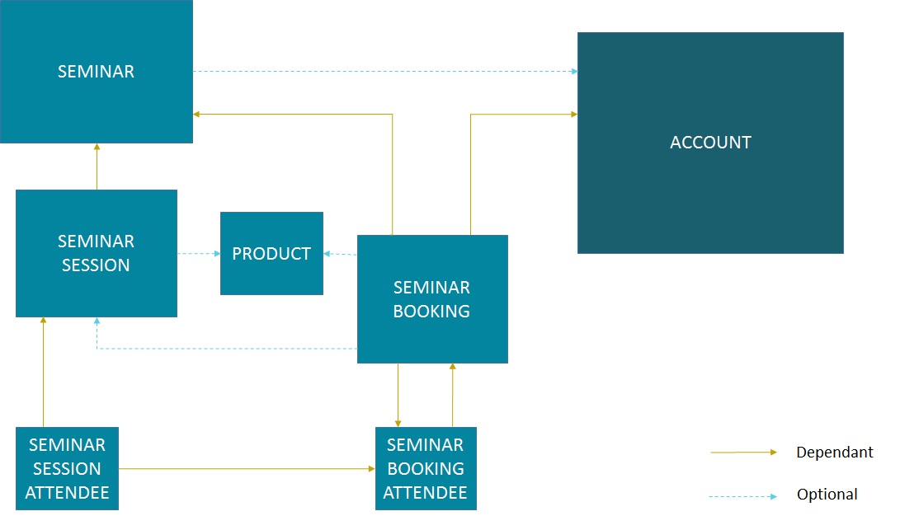
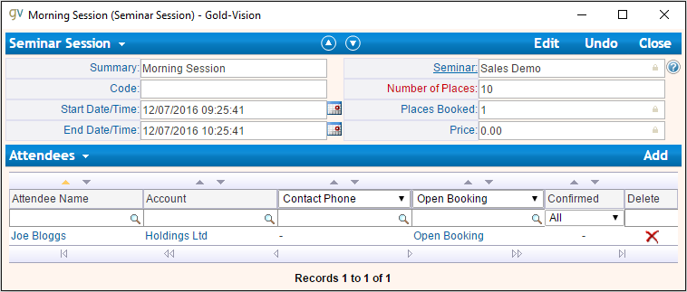

Gold-Vision Items
=================

.. _GVModelDiagram:

*************************
Gold-Vision Model Diagram
*************************

The diagram below helps you to gain a basic understanding of the structure for Gold-Vision items. So for example, if you were to create a new Contact in Gold-Vision, you can see that it is dependant on the Account item. Therefore, to create a new Contact, you will have to attach it to an existing Account. 

Core Items
##########

.. image:: images/GVModel.png
   :alt: Gold-Vision Item Model Diagram
   :align: center
   
Seminars
########
 

As you can see, things can become a little more difficult if you are looking to create a new Seminar Session Attendee record compared to a simple Contact record. By looking at the above diagram, to create a new Seminar Session Attendee record in Gold-Vision, you will need to have a Seminar Session and a Seminar Booking Attendee. However, the Seminar Session is dependant on a Seminar. Also, the Seminar Booking Attendee is dependant on a Seminar Booking of which is dependant on a Seminar and an Account.

Therefore, to create a Seminar Session Attendee record, you are required to have a Seminar Session, Seminar Booking Attendee, Seminar Booking, Seminar and Account. In contrast, to create a Contact, you are only required to have an Account.
   
.. warning::

    Using :ref:`AddItem` with an ``objectType`` value of **Campaign** will add a Campaign in Legacy Campaign mode and not in New Campaign mode.

*******
Account
*******
For the following example, I will be looking to create a new Account given that it does not exist already. The Account I wish to add is going to be called **Holdings Ltd**.

Finding the Account
###################

First of all I am going to make a Gold-Link request using :ref:`FindItem` to find out if I already have an account with the name **Holdings Ltd**. To do this, I will make the following request:

.. code-block:: html

    <soapenv:Envelope xmlns:soapenv="http://schemas.xmlsoap.org/soap/envelope/" xmlns:gold="http://service.gold-vision.com/gold-link">
	   <soapenv:Header/>
	   <soapenv:Body>
		  <gold:FindItem>
			 <gold:objectType>Account</gold:objectType>
			 <gold:XmlFilters>
				<filters xmlns="">
					<filter dbcolumn="SUMMARY" value="Holdings Ltd" />
				</filters>
			 </gold:XmlFilters>
		  </gold:FindItem>
	   </soapenv:Body>
	</soapenv:Envelope>
	
This is the response:

.. code-block:: html

    <soap:Envelope xmlns:soap="http://schemas.xmlsoap.org/soap/envelope/" xmlns:xsi="http://www.w3.org/2001/XMLSchema-instance" xmlns:xsd="http://www.w3.org/2001/XMLSchema">
	   <soap:Body>
		  <FindItemResponse xmlns="http://service.gold-vision.com/gold-link">
			 <FindItemResult>
				<gvdata xmlns="">
				   <list records="0"/>
				</gvdata>
			 </FindItemResult>
			 <success>true</success>
			 <message/>
		  </FindItemResponse>
	   </soap:Body>
	</soap:Envelope>
	
As you can see, the response has returned with a ``success`` result of true indicating the request was successful but also with a ``list`` attribute within the ``FindItemResult`` node. This ``list`` attribute indicates how many records have returned with a SUMMARY of **Holdings Ltd**.

From this result, it is apparent that there is no account with the name **Holdings Ltd** already in my Gold-Vision so I can then proceed to add the new account.

Updating an Account
###################

In the event that my :ref:`FindItem` request does return a result, you may decide that instead of creating a new account with the same name, you want to update the existing one instead. For example we may want to change ADDRESS_1 from **123 Old Street** to **321 New Street**.  For this situation the :ref:`FindItem` response will look something like this:

.. code-block:: html

    <soap:Envelope xmlns:soap="http://schemas.xmlsoap.org/soap/envelope/" xmlns:xsi="http://www.w3.org/2001/XMLSchema-instance" xmlns:xsd="http://www.w3.org/2001/XMLSchema">
	   <soap:Body>
		  <FindItemResponse xmlns="http://service.gold-vision.com/gold-link">
			 <FindItemResult>
				<gvdata xmlns="">
				   <list records="1">
					  <record id="72f46715-49f6-453c-8c63-201e0358459e" type="Account" ac_id="72f46715-49f6-453c-8c63-201e0358459e" summary="Holdings Ltd"/>
				   </list>
				</gvdata>
			 </FindItemResult>
			 <success>true</success>
			 <message/>
		  </FindItemResponse>
	   </soap:Body>
	</soap:Envelope>
	
Using the ``record id`` from the response, we can use :ref:`GetItem` to return all the account information for **Holding Ltd**. The request will look like this:

.. code-block:: html

    <soapenv:Envelope xmlns:soapenv="http://schemas.xmlsoap.org/soap/envelope/" xmlns:gold="http://service.gold-vision.com/gold-link">
	   <soapenv:Header/>
	   <soapenv:Body>
		  <gold:GetItem>
			 <gold:objectType>Account</gold:objectType>
			 <gold:id>72f46715-49f6-453c-8c63-201e0358459e</gold:id>
			 <gold:returnEmptyFields>false</gold:returnEmptyFields>
		  </gold:GetItem>
	   </soapenv:Body>
	</soapenv:Envelope>
	
with the resulting response showing as:

.. code-block:: html

    <soap:Envelope xmlns:soap="http://schemas.xmlsoap.org/soap/envelope/" xmlns:xsi="http://www.w3.org/2001/XMLSchema-instance" xmlns:xsd="http://www.w3.org/2001/XMLSchema">
	   <soap:Body>
		  <GetItemResponse xmlns="http://service.gold-vision.com/gold-link">
			 <GetItemResult>
				<gvdata xmlns="">
				   <record objecttype="Account" id="72f46715-49f6-453c-8c63-201e0358459e">
					  <field name="AC_ID" readOnly="true">72f46715-49f6-453c-8c63-201e0358459e</field>
					  <field name="SUMMARY" label="Account Name" details="">Holdings Ltd</field>
					  <field name="ACG_ID" type="uid" label="Security" details="" id="78b6dbd2-8611-4e6d-9360-ddc40fe61066">Public</field>
					  <field name="AC_NUMBER" label="Account Number"></field>
					  <field name="AC_POTENTIAL" readOnly="true" label="Account Potential" type="numeric">0.00</field>
					  <field name="AC_SALES" readOnly="true" label="Account Sales" type="numeric">0.00</field>
					  <field name="AC_DISCOUNT" type="number" label="Discount">0.0E0</field>
					  <field name="NAME" label="Account Name">Holdings Ltd</field>
					  <field name="AC_FLAG" type="uid" label="Support Status" details="" mustHaveInsert="false" mustHaveUpdate="false" id="c2c40237-f662-4f3d-913f-81e482fa4ca6">NEW CUSTOMER</field>
					  <field name="US_ID_SALES" type="uid" label="Account Manager" details="" id="a0833573-314a-49a8-b52a-569980821d94">Gold-Vision Administrator</field>
					  <field name="US_ID_SUPPORT" type="uid" label="Support Manager" details="" id="">Not Assigned</field>
					  <field name="TYPE_1" type="uid" label="Esteiro Relationship" details="" mustHaveInsert="false" mustHaveUpdate="false" id="">Not Set</field>
					  <field name="TYPE_2" type="uid" label="Account Type 2" details="" id="">Not Set</field>
					  <field name="LABEL" type="uid" label="Account Type 3" id="">Not Set</field>
					  <field name="LEVEL" type="uid" label="Account Type 4" id="">Not Set</field>
					  <field name="ACC_ID_SALES" type="uid" label="Primary Contact" details="" id="12422155-e45c-4ee7-b5dc-228f004425cf">Joe Bloggs</field>
					  <field name="ACC_ID_SUPPORT" type="uid" label="Support Contact" id="">Not Assigned</field>
					  <field name="ADDRESS_1" label="Primary Address" details="" mustHaveInsert="false" mustHaveUpdate="false">123 Old Street</field>
					  <field name="TOWN" label="Town/City" details="" mustHaveInsert="false" mustHaveUpdate="false">London</field>
					  <field name="COUNTRY" label="Country" details="">United Kingdom</field>
					...
				   </record>
				</gvdata>
			 </GetItemResult>
			 <success>true</success>
			 <message/>
		  </GetItemResponse>
	   </soap:Body>
	</soap:Envelope>
	
As you can see, the resulting ``gvdata`` contains all the account information about **Holdings Ltd** including the ADDRESS_1 field of which has a value of **123 Old Street**.

To update this field to **321 New Street**, we are going to use the ADDRESS_1 field and include it in an :ref:`UpdateItem` request like below:

.. code-block:: html

    <soap:Envelope xmlns:soap="http://www.w3.org/2003/05/soap-envelope" xmlns:gold="http://service.gold-vision.com/gold-link">
	   <soap:Header/>
	   <soap:Body>
		  <gold:UpdateItem>
			 <gold:objectType>Account</gold:objectType>
			 <gold:xmlData>
				<gvdata xmlns="">
				<record><field name="ADDRESS_1">321 New Street</field></record>
				</gvdata>
			 </gold:xmlData>
			 <gold:id>72f46715-49f6-453c-8c63-201e0358459e</gold:id>
			 <gold:overwrite>AllFieldsPresent</gold:overwrite>
		  </gold:UpdateItem>
	   </soap:Body>
	</soap:Envelope>
	
This should return with a response in which ``success`` has resulted in **true**. You should now find that the ADDRESS_1 field has been updated from **123 Old Street** to **321 New Street**.

Creating a new Account
######################

In the event that you have made a :ref:`FindItem` request that was successful but returned 0 Accounts with a SUMMARY of **Holding Ltd**, you may feel it is now safe to create a new Account with the same name. To do so, you would have to make an :ref:`AddItem` request as follows:

.. code-block:: html

    <soapenv:Envelope xmlns:soapenv="http://schemas.xmlsoap.org/soap/envelope/" xmlns:gold="http://service.gold-vision.com/gold-link">
	   <soapenv:Header/>
	   <soapenv:Body>
		  <gold:AddItem>
			 <gold:objectType>Account</gold:objectType>
			 <gold:xmlData>
				<gvdata xmlns="">
				<record>
				<field name="SUMMARY">Holding Ltd</field>
				<field name="NAME">Holding Ltd</field>
				<field name="ADDRESS_1">321 New Street</field>
				<field name="TOWN">London</field>
				<field name="COUNTRY">United Kingdom</field>
				</record>
				</gvdata>
			 </gold:xmlData>
		  </gold:AddItem>
	   </soapenv:Body>
	</soapenv:Envelope>
	
This request will create a new Account that will also have data set for it's **Primary Address**, **City/Town** and **Country** fields.

As a result, the response will return with the Account ID of the newly created Account and the following record will appear in Gold-Vision:

.. image:: images/HoldingLtdRecord.PNG
   :alt: Holding Ltd Account Record
   :align: center

*******
Contact
*******

First of all, before we look to create a new contact we need to have a look at the :ref:`GVModelDiagram` at the top of this page. As we can see, A Contact record is dependant on an Account record. Therefore, to create a Contact in Gold-Vision via Gold-Link, we need to provide an **AC_ID** with it.

So the first thing to do would be to make a :ref:`FindItem` request to get an **AC_ID** of an Account. When creating a new Contact, this **AC_ID** is required to be included otherwise the request will fail. The following request is to add a **Joe Bloggs** to the **Holdings Ltd** Account.

.. code-block:: html

    <soapenv:Envelope xmlns:soapenv="http://schemas.xmlsoap.org/soap/envelope/" xmlns:gold="http://service.gold-vision.com/gold-link">
	   <soapenv:Header/>
	   <soapenv:Body>
		  <gold:AddItem>
			 <gold:objectType>Contact</gold:objectType>
			 <gold:xmlData>
				<gvdata xmlns="">
				<record>
					<field name="AC_ID">72f46715-49f6-453c-8c63-201e0358459e</field>
					<field name="FIRSTNAME">Joe</field>
					<field name="LASTNAME">Bloggs</field>
				</record>
				</gvdata>
			 </gold:xmlData>
		  </gold:AddItem>
	   </soapenv:Body>
	</soapenv:Envelope>

As a result, the ``returnId`` node will contain the new **ACC_ID** of the new Contact. 

***********
Opportunity
***********

To create an Opportunity, you are required to provide an **AC_ID** with the :ref:`AddItem` request. However, Opportunities, Activities, Projects, Quotes and Profiles allow you to attach a Contact from the related Account as well. Although, this isn't essential and if no **ACC_ID** is provided, the Contact field will display as **Not Assigned**.

Therefore, the process for creating an Opportunity with a Contact assigned will require you to make two :ref:`FindItem` requests. The first will be to find the **AC_ID** of an Account and the second will be to find a Contact's **ACC_ID** that has that also has this **AC_ID**. An :ref:`AddItem` request can then be made to create an Opportunity with an **AC_ID** and an **ACC_ID**. The request will look like this:

.. code-block:: html

    <soapenv:Envelope xmlns:soapenv="http://schemas.xmlsoap.org/soap/envelope/" xmlns:gold="http://service.gold-vision.com/gold-link">
	   <soapenv:Header/>
	   <soapenv:Body>
		  <gold:AddItem>
			 <gold:objectType>Opportunity</gold:objectType>
			 <gold:xmlData>
				<gvdata xmlns="">
				<record>
					<field name="AC_ID">72f46715-49f6-453c-8c63-201e0358459e</field>
					<field name="SUMMARY">Sales Opportunity</field>
					<field name="ACC_ID">12422155-e45c-4ee7-b5dc-228f004425cf</field>
				</record>
				</gvdata>
			 </gold:xmlData>
		  </gold:AddItem>
	   </soapenv:Body>
	</soapenv:Envelope>
	
As a result, the ``returnId`` node will contain the new **OP_ID** of the new Opportunity and the following record will appear within your Gold-Vision:

.. image:: images/SalesOppRecord.PNG
   :alt: Sales Opportunity Record
   :align: center
   
*******
Seminar
*******

For this section we are going to run through the process required to add a Seminar Session Attendee into Gold-Vision. Looking at the :ref:`GVModelDiagram` we can see that there are a  lot of requirements for a Seminar Session Attendee to exist.

First of all we are going to create a Seminar. This is the request to be made:

.. code-block:: html

    <soapenv:Envelope xmlns:soapenv="http://schemas.xmlsoap.org/soap/envelope/" xmlns:gold="http://service.gold-vision.com/gold-link">
	   <soapenv:Header/>
	   <soapenv:Body>
		  <gold:AddItem>
			 <gold:objectType>Seminar</gold:objectType>
			 <gold:xmlData>
				<gvdata xmlns="">
				<record>
					<field name="SUMMARY">Sales Demo</field>
					<field name="AC_ID">72f46715-49f6-453c-8c63-201e0358459e</field>
				</record>
				</gvdata>
			 </gold:xmlData>
		  </gold:AddItem>
	   </soapenv:Body>
	</soapenv:Envelope>

The above request will create a Seminar called 'Sales Demo' for the Account 'Holding Ltd'. The AC_ID is an optional field.

Now we have a Seminar, the next step would be to create a Seminar Session for our attendee to attend. This is the request that will be made:

.. code-block:: html

    <soapenv:Envelope xmlns:soapenv="http://schemas.xmlsoap.org/soap/envelope/" xmlns:gold="http://service.gold-vision.com/gold-link">
	   <soapenv:Header/>
	   <soapenv:Body>
		  <gold:AddItem>
			 <gold:objectType>SeminarSession</gold:objectType>
			 <gold:xmlData>
				<gvdata xmlns="">
				<record>
					<field name="SUMMARY">Morning Session</field>
					<field name="SEM_ID">687bf90e-a4a3-44fa-8502-145605d61243</field>
					<field name="PLACES">10</field>
				</record>
				</gvdata>
			 </gold:xmlData>
		  </gold:AddItem>
	   </soapenv:Body>
	</soapenv:Envelope>
	
.. note::

    A Seminar Session only requires a SUMMARY and SEM_ID. However, in order to make a Seminar Booking, the Seminar Session is required to have places available. Therefore, I have created a Seminar Session that has 10 places available to allow for bookings to take place.
	
Now we have our Seminar Session, again by looking at the :ref:`GVModelDiagram`, we can see that the only other dependency for a Seminar Session Attendee is to have a Seminar Booking Attendee.

Before a Seminar Booking Attendee can be made, a Seminar Booking is required to exist. I will create a Seminar Booking with the following request:

.. code-block:: html

    <soapenv:Envelope xmlns:soapenv="http://schemas.xmlsoap.org/soap/envelope/" xmlns:gold="http://service.gold-vision.com/gold-link">
	   <soapenv:Header/>
	   <soapenv:Body>
		  <gold:AddItem>
			 <gold:objectType>SeminarBooking</gold:objectType>
			 <gold:xmlData>
				<gvdata xmlns="">
				<record>
					<field name="SEM_ID">687bf90e-a4a3-44fa-8502-145605d61243</field>
					<field name="SEMS_ID">d83a773d-32a3-4127-afbf-e66695600ecc</field>
					<field name="AC_ID">72f46715-49f6-453c-8c63-201e0358459e</field>
					<field name="REFERENCE">SES001</field>
				</record>
				</gvdata>
			 </gold:xmlData>
		  </gold:AddItem>
	   </soapenv:Body>
	</soapenv:Envelope>
	
.. note::

    Although the request has been successful, for a Seminar Booking to appear in Gold-Vision, it needs to have a Seminar Booking Attendee. However, a Seminar Booking Attendee request cannot be made beforehand as it is required to have a SEMB_ID.
	
The next step to be made will be to create a Seminar Booking Attendee for the Seminar Booking that we have just created:

.. code-block:: html

    <soapenv:Envelope xmlns:soapenv="http://schemas.xmlsoap.org/soap/envelope/" xmlns:gold="http://service.gold-vision.com/gold-link">
	   <soapenv:Header/>
	   <soapenv:Body>
		  <gold:AddItem>
			 <gold:objectType>SeminarBookingAttendee</gold:objectType>
			 <gold:xmlData>
				<gvdata xmlns="">
				<record>
					<field name="SEMB_ID">828048a9-2f39-4cae-a065-3c0da64c6353</field>
					<field name="AC_ID">72f46715-49f6-453c-8c63-201e0358459e</field>
					<field name="ACC_ID">12422155-e45c-4ee7-b5dc-228f004425cf</field>
				</record>
				</gvdata>
			 </gold:xmlData>
		  </gold:AddItem>
	   </soapenv:Body>
	</soapenv:Envelope>
	
The above request has now created a Seminar Booking Attendee using the Contact 'Joe Bloggs'. The required fields for this request are SEMB_ID and AC_ID. If no ACC_ID is provided, a Seminar Booking Attendee will be added as 'Anonymous'.

Now that all the prerequisites are met, we can finally make a request to add a new Seminar Session Attendee. This is the request that will be made:

.. code-block:: html

    <soapenv:Envelope xmlns:soapenv="http://schemas.xmlsoap.org/soap/envelope/" xmlns:gold="http://service.gold-vision.com/gold-link">
	   <soapenv:Header/>
	   <soapenv:Body>
		  <gold:AddItem>
			 <gold:objectType>SeminarSessionAttendee</gold:objectType>
			 <gold:xmlData>
				<gvdata xmlns="">
				<record>
					<field name="SEMBA_ID">ddf4dbcd-53af-4b6e-aef8-bf55f6ff7ab8</field>
					<field name="SEMS_ID">d83a773d-32a3-4127-afbf-e66695600ecc</field>
				</record>
				</gvdata>
			 </gold:xmlData>
		  </gold:AddItem>
	   </soapenv:Body>
	</soapenv:Envelope>
	
A Seminar Session Attendee will now appear in your Gold-Vision like below:

   
*************
Phone Systems
*************

LogCall
########

It is possible to log incoming and outgoing telephone calls within Gold-Vision using Gold-Link. To do so, you can make a **LogCall** request like below:

.. code-block:: html

    <soapenv:Envelope xmlns:soapenv="http://schemas.xmlsoap.org/soap/envelope/" xmlns:gold="http://service.gold-vision.com/gold-link">
	   <soapenv:Header/>
	   <soapenv:Body>
		  <gold:LogCall>
			 <gold:accountId>71fb89cb-92ad-4973-8293-d43f1cd98673</gold:accountId>
			 <gold:contactId>ca194711-f378-48c4-88f2-b8ae22207091</gold:contactId>
			 <gold:number>01234 567890</gold:number>
			 <gold:inbound>true</gold:inbound>
		  </gold:LogCall>
	   </soapenv:Body>
	</soapenv:Envelope>

This request will return a result with a ``success`` node and a ``message`` node. If ``success`` appears as 'false', the ``message`` node will display the error that caused the request to fail.

.. note::

    It is possible to send this request without a ``contactId`` value. By leaving this node empty, a telephone call will be entered into Gold-Vision against the given Account rather than against a Contact.
	
LogCallWithDuration
###################

An extension to the **LogCall** request is to make a **LogCallWithDuration** request that includes additional data to indicate how long the telephone call had lasted.

This is what a **LogCallWithDuration** request will look like:

.. code-block:: html

    <soapenv:Envelope xmlns:soapenv="http://schemas.xmlsoap.org/soap/envelope/" xmlns:gold="http://service.gold-vision.com/gold-link">
	   <soapenv:Header/>
	   <soapenv:Body>
		  <gold:LogCallwithDuration>
			 <gold:accountId>71fb89cb-92ad-4973-8293-d43f1cd98673</gold:accountId>
			 <gold:contactId>ca194711-f378-48c4-88f2-b8ae22207091</gold:contactId>
			 <gold:number>01234 567890</gold:number>
			 <gold:inbound>true</gold:inbound>
			 <gold:duration>3</gold:duration>
		  </gold:LogCallwithDuration>
	   </soapenv:Body>
	</soapenv:Envelope>
	
This request adds an inbound telephone call against the Contact **Joe Bloggs** and Account **Holding Ltd** as well as giving the record a duration value of **3**.

LookupPhoneNumber
#################

This request is useful when looking to return all matching Contacts and Accounts with the input of a telephone number. The request will look similar to this:

.. code-block:: html

    <soapenv:Envelope xmlns:soapenv="http://schemas.xmlsoap.org/soap/envelope/" xmlns:gold="http://service.gold-vision.com/gold-link">
	   <soapenv:Header/>
	   <soapenv:Body>
		  <gold:LookupPhoneNumber>
			 <gold:number>01234 567890</gold:number>
		  </gold:LookupPhoneNumber>
	   </soapenv:Body>
	</soapenv:Envelope>
	
The response will return a ``list`` node that will contain both ``account`` and ``contact`` records if any match the telephone number sent with the original request. This is the sort of response that you are likely to receive:

.. code-block:: html

    <soap:Envelope xmlns:soap="http://schemas.xmlsoap.org/soap/envelope/" xmlns:xsi="http://www.w3.org/2001/XMLSchema-instance" xmlns:xsd="http://www.w3.org/2001/XMLSchema">
	   <soap:Body>
		  <LookupPhoneNumberResponse xmlns="http://service.gold-vision.com/gold-link">
			 <LookupPhoneNumberResult>
				<gvdata xmlns="">
				   <list>
					  <account id="71fb89cb-92ad-4973-8293-d43f1cd98673">
						 <ac_name>Holding Ltd</ac_name>
						 <ac_id>71fb89cb-92ad-4973-8293-d43f1cd98673</ac_id>
						 <ac_phone/>
						 <ac_link>http://gvsandbox01/Gold-VisionThorne/goldvision.aspx?page=popthru&amp;killwindow=1&amp;action=OpenAccount&amp;actiondata=71fb89cb-92ad-4973-8293-d43f1cd98673</ac_link>
						 <contacts>
							<contact id="ca194711-f378-48c4-88f2-b8ae22207091">
							   <acc_name>Joe Bloggs</acc_name>
							   <acc_id>ca194711-f378-48c4-88f2-b8ae22207091</acc_id>
							   <acc_phone>01234 567890</acc_phone>
							   <acc_mobile/>
							   <acc_link>http://gvsandbox01/Gold-VisionThorne/goldvision.aspx?page=popthru&amp;killwindow=1&amp;action=OpenContact&amp;actiondata=ca194711-f378-48c4-88f2-b8ae22207091</acc_link>
							   <acc_match>true</acc_match>
							</contact>
						 </contacts>
					  </account>
				   </list>
				</gvdata>
			 </LookupPhoneNumberResult>
			 <success>true</success>
			 <message/>
		  </LookupPhoneNumberResponse>
	   </soap:Body>
	</soap:Envelope>
    